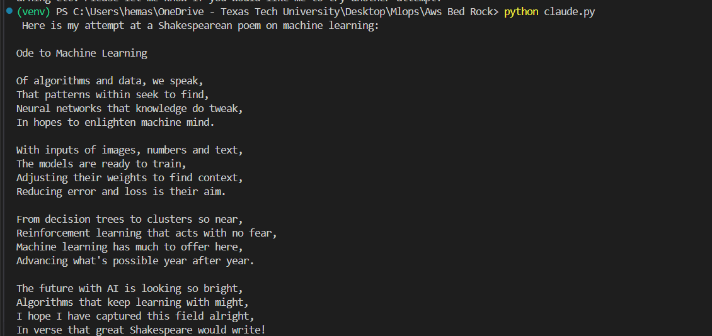

This project is about the text generation using claude and llama3

Project Setup 

Go to command line and clone the repository and perform the below steps in command line :

git clone https://github.com/HEMASRI-NAKIRIKANTI/Claude_and_llama_3_Test_in_local.git

py -3.11 venv venv

cd venv/scripts

.\activate

Go to the main folder and download the requirements

pip install -r requirements.txt

Activate the models in the region before you start working on thr project and create a Iam user and get the access key and seceret key

Commands :

aws configure

python llama3.py

python claude.py

